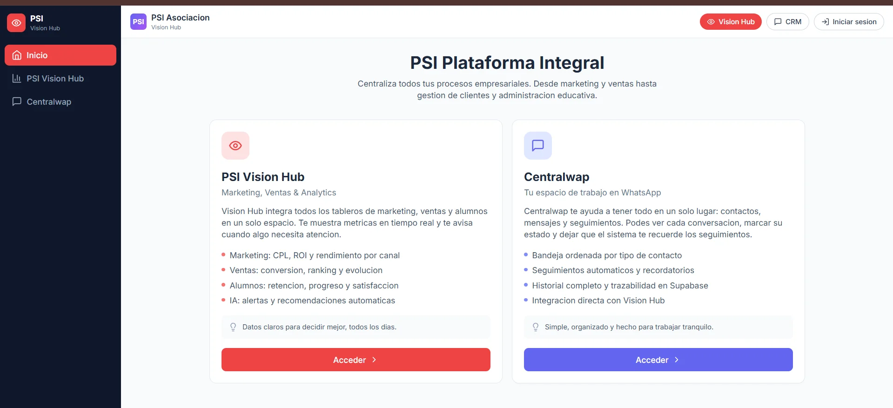
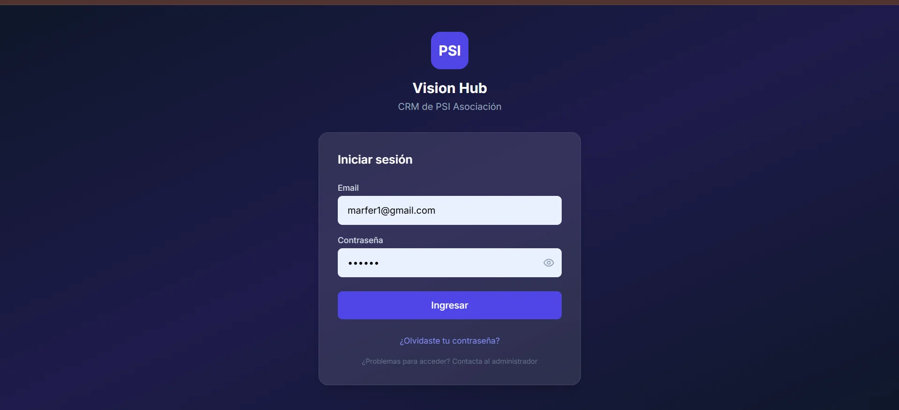
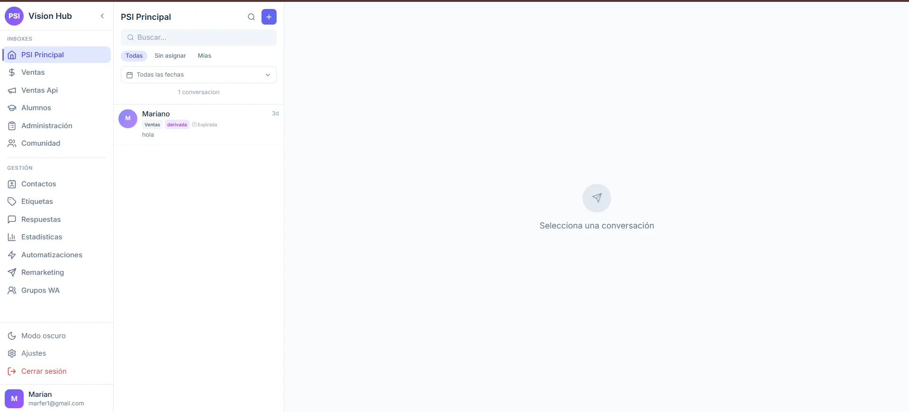
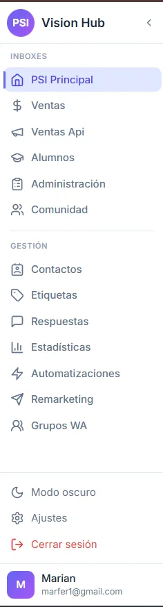
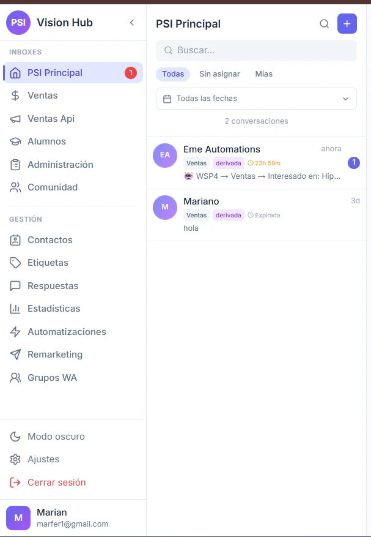
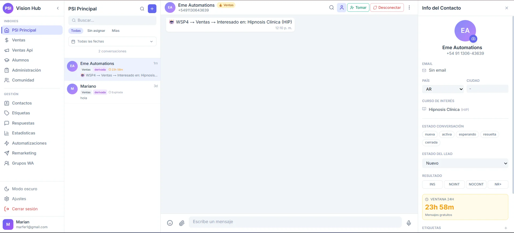
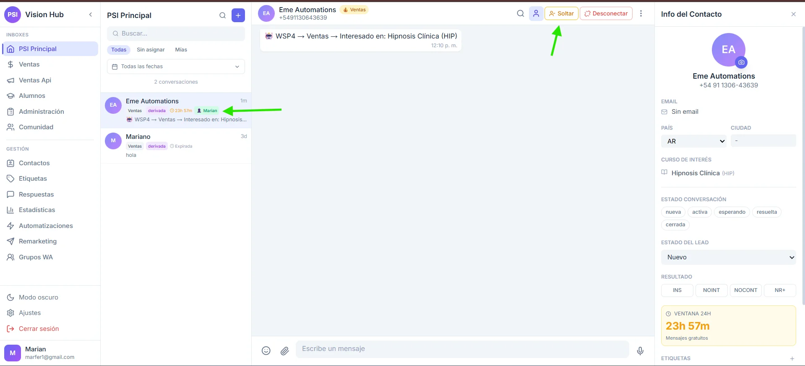
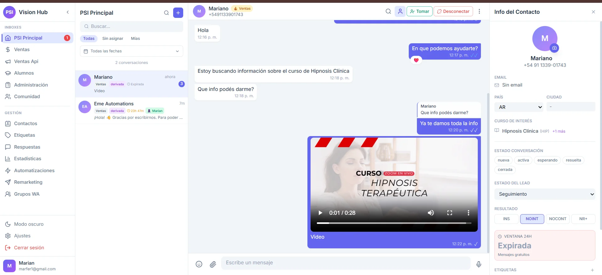

# Manual de Usuario - CRM Centralwap

**Versión:** 1.2  
**Última actualización:** 3 de Enero 2025

---

## Índice

1. [Primeros Pasos](#1-primeros-pasos)
2. [Interfaz Principal](#2-interfaz-principal)
3. [Gestión de Conversaciones](#3-gestión-de-conversaciones)
4. [Área de Chat](#4-área-de-chat)
5. [Asignación de Conversaciones](#5-asignación-de-conversaciones)
6. [Panel de Contacto](#6-panel-de-contacto)
7. [Envío de Mensajes](#7-envío-de-mensajes)
8. [Respuestas Rápidas](#8-respuestas-rápidas)
9. [Multimedia](#9-multimedia)
10. [Reacciones y Citas](#10-reacciones-y-citas)
11. [Notificaciones](#11-notificaciones)
12. [Atajos de Teclado](#12-atajos-de-teclado)
13. [Preguntas Frecuentes](#13-preguntas-frecuentes)

---

## 1. Primeros Pasos

### 1.1 Acceso al Sistema

El sistema cuenta con un **Hub selector** que permite acceder a los diferentes módulos de la plataforma.



Desde el Hub podés acceder a:
- **Vision Hub**: Dashboard de métricas y BI
- **Centralwap**: CRM de WhatsApp (este manual)

### 1.2 Inicio de Sesión



1. Ingresá tu **email** corporativo
2. Ingresá tu **contraseña**
3. Hacé clic en **Iniciar Sesión**

> **Nota:** Si olvidaste tu contraseña, contactá al administrador del sistema.

### 1.3 Primer Vistazo

Al ingresar verás el dashboard principal con tres áreas:



| Área | Ubicación | Función |
|------|-----------|---------|
| Sidebar | Izquierda (72px) | Navegación entre módulos |
| Panel de Conversaciones | Centro-izquierda | Lista de chats |
| Área de Chat | Centro-derecha | Conversación activa |

---

## 2. Interfaz Principal

### 2.1 Sidebar de Navegación



El sidebar está dividido en secciones:

**Inboxes (Líneas WhatsApp):**
- PSI Principal (Router)
- Ventas
- Ventas Api
- Alumnos
- Administración
- Comunidad

**Gestión:**
- Contactos
- Etiquetas
- Respuestas Rápidas
- Estadísticas
- Automatizaciones
- Remarketing
- Grupos WA

### 2.2 Indicadores del Sidebar

| Indicador | Significado |
|-----------|-------------|
| Número en badge | Conversaciones sin leer en ese inbox |
| Icono resaltado | Sección actualmente activa |

---

## 3. Gestión de Conversaciones

### 3.1 Lista de Conversaciones



Cada conversación muestra:

| Elemento | Descripción |
|----------|-------------|
| **Avatar** | Inicial del nombre o ícono |
| **Nombre** | Nombre del contacto |
| **Preview** | Últimas palabras del mensaje |
| **Tiempo** | Hace cuánto fue el último mensaje |
| **Badge azul** | Cantidad de mensajes sin leer |
| **Ventana** | Tiempo restante (ej: "23h 59m") |

### 3.2 Filtros Disponibles

- **Por inbox**: Click en el inbox del sidebar
- **Por búsqueda**: Escribir en el campo de búsqueda
- **Por estado**: Usar filtros de estado (si disponibles)

### 3.3 Estados de Conversación

| Estado | Color | Significado |
|--------|-------|-------------|
| Activa | Verde | Conversación en curso |
| En menú | Amarillo | Usuario navegando menú IVR |
| Derivada | Azul | Enviada a un área específica |
| Cerrada | Gris | Resuelta |

---

## 4. Área de Chat

### 4.1 Header del Chat



El header muestra:
- **Nombre del contacto**
- **Teléfono**
- **Botón Tomar/Soltar** (asignación)
- **Botón de info** (abre panel derecho)

### 4.2 Área de Mensajes

Los mensajes se muestran en burbujas:

| Tipo | Posición | Color |
|------|----------|-------|
| Entrante (cliente) | Izquierda | Gris claro |
| Saliente (agente) | Derecha | Verde/Azul |
| Sistema | Centro | Gris con borde |

### 4.3 Indicadores de Mensaje

| Indicador | Significado |
|-----------|-------------|
| ✓ | Enviado |
| ✓✓ | Entregado |
| ✓✓ (azul) | Leído |
| 🕐 | Pendiente de envío |

---

## 5. Asignación de Conversaciones

### 5.1 Tomar una Conversación


1. Abrí la conversación
2. Hacé clic en el botón **"Tomar"** en el header
3. La conversación queda asignada a tu usuario

### 5.2 Soltar una Conversación



1. Si la conversación está asignada a vos, verás el botón **"Soltar"**
2. Hacé clic para liberar la conversación
3. Otro agente podrá tomarla

### 5.3 Indicador de Asignación

Cuando una conversación está asignada a otro agente:
- Verás un badge con **👤 + nombre del agente**
- No podrás tomar la conversación sin que la libere

---

## 6. Panel de Contacto

### 6.1 Abrir el Panel

Hacé clic en el botón de información (ℹ️) en el header del chat para abrir el panel lateral derecho.

### 6.2 Información Disponible


| Campo | Descripción |
|-------|-------------|
| **Nombre** | Nombre del contacto (editable) |
| **Teléfono** | Número en formato internacional |
| **Email** | Email del contacto (editable) |
| **Estado del Lead** | Nuevo, Contactado, Interesado, etc. |
| **Etiquetas** | Tags asignados |
| **Notas** | Comentarios internos |
| **Cursos de Interés** | Productos en los que mostró interés |

### 6.3 Ventana de Tiempo



El panel muestra el estado de la ventana de WhatsApp:
- **Verde con tiempo**: Ventana activa (ej: "23h 45m")
- **Rojo "EXPIRADA"**: Ventana cerrada, requiere template

### 6.4 Múltiples Cursos de Interés

Si el contacto mostró interés en varios cursos, verás los primeros y un badge **"+N más"** indicando cuántos adicionales hay.

---

## 7. Envío de Mensajes

### 7.1 Área de Input

En la parte inferior del chat encontrás:
- **Campo de texto**: Escribí tu mensaje
- **Botón adjuntar** (📎): Para multimedia
- **Botón enviar** (➤): Enviar mensaje

### 7.2 Enviar un Mensaje de Texto

1. Escribí el mensaje en el campo
2. Presioná **Enter** o hacé clic en enviar
3. El mensaje aparecerá en la conversación

### 7.3 Mensajes con Formato

WhatsApp soporta formato básico:
- `*texto*` → **negrita**
- `_texto_` → _cursiva_
- `~texto~` → ~~tachado~~
- ``` `texto` ``` → `monoespaciado`

---

## 8. Respuestas Rápidas

### 8.1 Cómo Usar

1. En el campo de texto, escribí `/`
2. Aparecerá una lista de respuestas disponibles
3. Seleccioná la que necesitás o seguí escribiendo para filtrar
4. Presioná Enter para insertar

### 8.2 Variables Automáticas

Las respuestas rápidas pueden incluir variables:

| Variable | Se reemplaza por |
|----------|------------------|
| `{nombre}` | Nombre del contacto |
| `{telefono}` | Teléfono del contacto |
| `{agente}` | Tu nombre de agente |

### 8.3 Ejemplo

Respuesta guardada:
```
Hola {nombre}! Gracias por escribirnos. ¿En qué podemos ayudarte?
```

Se envía como:
```
Hola Juan! Gracias por escribirnos. ¿En qué podemos ayudarte?
```

---

## 9. Multimedia

### 9.1 Enviar Archivos

1. Hacé clic en el botón **adjuntar** (📎)
2. Seleccioná el tipo: Imagen, Video, Documento, Audio
3. Elegí el archivo de tu computadora
4. Confirmá el envío

### 9.2 Tipos Soportados

| Tipo | Formatos | Tamaño Máximo |
|------|----------|---------------|
| Imagen | JPG, PNG, WebP | 16 MB |
| Video | MP4, 3GP | 16 MB |
| Audio | MP3, OGG, M4A | 16 MB |
| Documento | PDF, DOC, XLS | 100 MB |

### 9.3 Recibir Multimedia


Los archivos recibidos se muestran:
- **Imágenes**: Preview en la burbuja
- **Videos**: Reproductor embebido con controles (play, barra de progreso, volumen, pantalla completa)
- **Audios**: Reproductor con botón play y duración
- **Documentos**: Ícono + nombre, click para descargar

### 9.4 Notas de Voz

Para enviar una nota de voz:
1. Hacé clic en el botón de **micrófono** (🎤)
2. Permitir acceso al micrófono si es la primera vez
3. Grabá tu mensaje
4. Hacé clic en **enviar** o **cancelar**

---

## 10. Reacciones y Citas

### 10.1 Reacciones con Emojis


Los mensajes pueden tener reacciones con emojis. Las reacciones aparecen **debajo del mensaje** con el emoji correspondiente (ej: ❤️).

### 10.2 Citar/Responder Mensajes

Para responder a un mensaje específico:
1. Hacé clic derecho sobre el mensaje (o deslizá en móvil)
2. Seleccioná **"Responder"**
3. Escribí tu respuesta
4. El mensaje citado aparecerá arriba de tu respuesta

La cita muestra:
- **Nombre del autor** del mensaje original
- **Texto citado** (preview)
- **Tu respuesta** debajo

---

## 11. Notificaciones

### 11.1 Notificaciones del Navegador

El CRM puede enviarte notificaciones cuando:
- Llega un nuevo mensaje
- Te asignan una conversación
- Mencionan tu usuario

### 11.2 Habilitar Notificaciones

1. El navegador pedirá permiso la primera vez
2. Hacé clic en **"Permitir"**
3. Las notificaciones aparecerán aunque tengas otra pestaña activa

### 11.3 Indicador en Pestaña

- El **favicon** cambia cuando hay mensajes sin leer
- El **título** muestra el contador: "(3) Centralwap"

---

## 12. Atajos de Teclado

| Atajo | Acción |
|-------|--------|
| `Enter` | Enviar mensaje |
| `Shift + Enter` | Nueva línea (sin enviar) |
| `/` | Abrir respuestas rápidas |
| `Esc` | Cerrar modales/paneles |
| `Ctrl + K` | Búsqueda rápida |

---

## 13. Preguntas Frecuentes

### ¿Por qué no puedo enviar mensajes?

**Posibles causas:**
1. **Ventana expirada**: Pasaron más de 24h (o 72h si vino de Meta Ads)
2. **Sin asignar**: Tomá la conversación primero
3. **Error de conexión**: Refrescá la página

### ¿Qué significa el badge "+1 más" en cursos?

Significa que el contacto mostró interés en más cursos de los que se muestran. Hacé clic para ver la lista completa.

### ¿Cómo sé si un mensaje fue leído?

Los dos checks azules (✓✓) indican que el mensaje fue leído por el destinatario.

### ¿Puedo ver conversaciones de otros agentes?

Depende de tus permisos. Los supervisores pueden ver todas las conversaciones.

### ¿Por qué la ventana aparece en rojo como "EXPIRADA"?

La ventana de 24 horas de WhatsApp cerró. Para volver a contactar al cliente necesitás usar un **template aprobado** (esto puede tener costo).

### ¿Cómo funcionan las reacciones?

Las reacciones con emojis se muestran debajo del mensaje. El cliente puede reaccionar a tus mensajes y vos podés ver qué emoji usó.

### ¿Cómo cito un mensaje anterior?

Hacé clic derecho sobre el mensaje que querés citar y seleccioná "Responder". Tu mensaje aparecerá con el texto original citado arriba.

---

**¿Tenés más preguntas?** Contactá al administrador del sistema.
